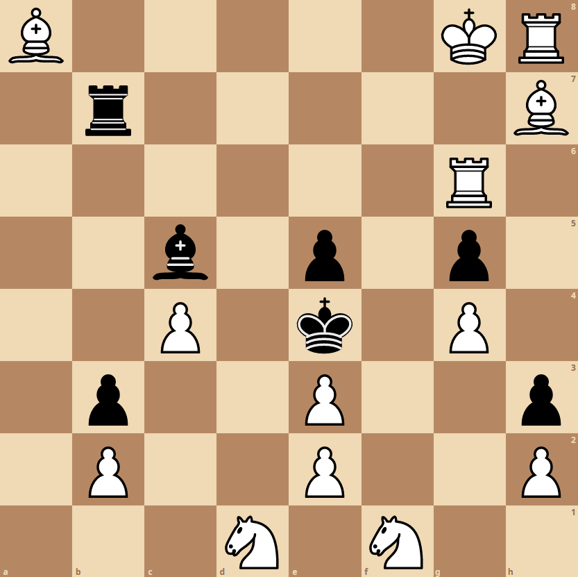

Jørgen considers himself a great chess player, and has dragged you into a friendly match. However, despite some unorthodox moves, you have held your own with the white pieces, and it is your turn:

However, you know that Jørgen is a *very* poor loser, and he will never let you hear the end of it if you win now. As white, can you find the one move which *doesn't* put the black king in checkmate?

When you've found this move, the flag is  `d:ctf{delay-checkmate-with-x1-to-y2}` where `x1` and `y2` are replaced with the square you're moving a piece from, and the square you're moving it to. For instance, if the correct move is to move the knight on *d1* to *c3*, the flag would be  `d:ctf{delay-checkmate-with-d1-to-c3}`.