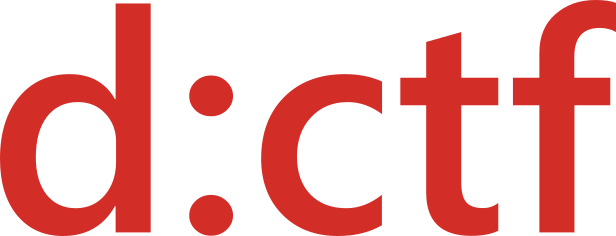

# d:CTF 2021

The CTF competition arranged for the d:hack 2021 hackathon at DIPS AS.

The competition features four challenge categories:

* *Web* challenges about exploiting vulnerabilities in web applications
* *Reverse* challenges about reverse-engineering secrets and algorithms from programs
* *Crypto* challenges about cryptography and code breaking
* *Misc* challenges, about creative problem solving

The challenges are intended for newcomers to CTF contests.

## Setup

If you have Docker Compose installed, you can run the challenges yourself with `docker-compose up` in the root directory.